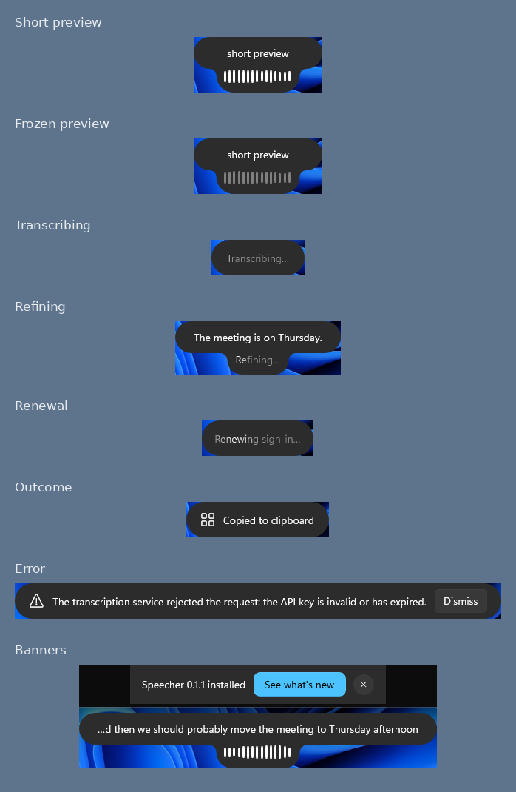
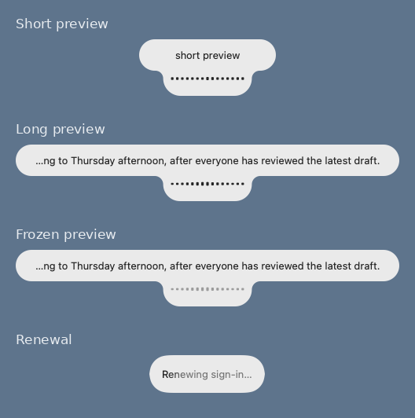

# Native popup layout evidence

The preview sits above a compact waveform or processing label inside one connected outline. Rounded cutouts follow the lower content's width. Previews have 12 points of top padding, an 8-point gap above the lower strip and 8 points of bottom padding, and the contour's shoulder sits 12 points below the preview text so it reads centered in the wide bar. Empty previews and sign-in renewal use a standalone capsule. The reference is the accepted Linux test implementation at `575671e`.

## Windows

The after images show Windows source `fbc5672`, built with MSVC and Qt 6.8.3 and captured from the Windows 11 VM desktop. The original before images use `b67b7fc`. The layout-update comparison uses the previous PR layout at `313b255` on its left. Captures use synthetic speech levels and sample text in an isolated test profile.

Windows uses the existing theme-aware acrylic brush. It renders as a flat fill in this VM; the blue areas outside the contour are the desktop wallpaper. These images establish layout and shape, not desktop translucency.

The full build and all 21 CTest suites passed before the padding adjustment. The updated native build and focused desktop suite also passed. Interactive frontend tests passed 21 cases with one deliberately gated visual driver skipped. The actual screenshot test ran successfully. A separate capture with notices passed, including the What's New action and dismissal control. The updated geometry assertion failed against the old horizontal layout, then passed with the new contour. Existing Unicode fitting and window-behavior tests also passed.

## macOS

The final macOS source is `fbc5672`. Native captures come from [workflow 34594746414](https://github.com/firemonster612/speecher/actions/runs/34594746414). The main comparison uses frames from the packaged app's scripted dictation flow. Short, long, frozen and renewal images come from the bridge-driven native panel test in the same workflow. Both sets render the real SwiftUI views. The build, tests and all three application-flow verdicts passed. The final captures were inspected, including transitions back to processing and receipt capsules.

The original before captures use `b67b7fc` from [workflow 34398156576](https://github.com/firemonster612/speecher/actions/runs/34398156576). The layout-update comparison uses the previous PR layout from [workflow 34461408821](https://github.com/firemonster612/speecher/actions/runs/34461408821) on its left. Flow frames pair equivalent states; animation timing, preview words and receipt details may differ between runs.

The carved preview uses macOS regular material. Standalone capsules retain the built-in Liquid Glass shape on macOS 26. The conditional background preserves the foreground waveform view as previews appear and disappear.

Comparison sheets retain each source image's pixel scale. Transparent pixels are composited onto a blue-grey background for readability; that background is not an application color. Original PNG captures are included beside the comparison sheets.

The spacing comparisons pair the previous 4-point shoulder at `f01077e` with the centered bar using identical sample text. Only the painted outline moved; panel heights are unchanged. The Linux PR applies the same geometry.
